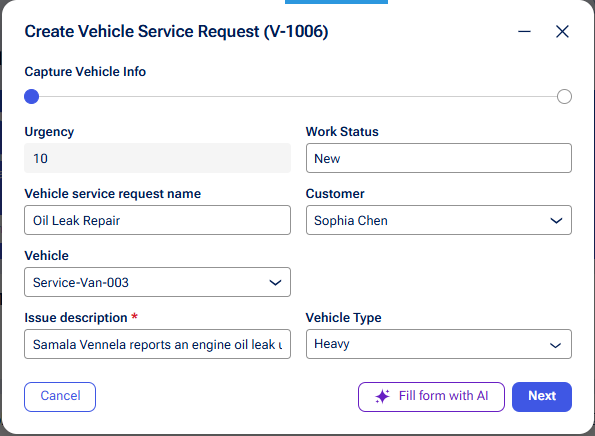
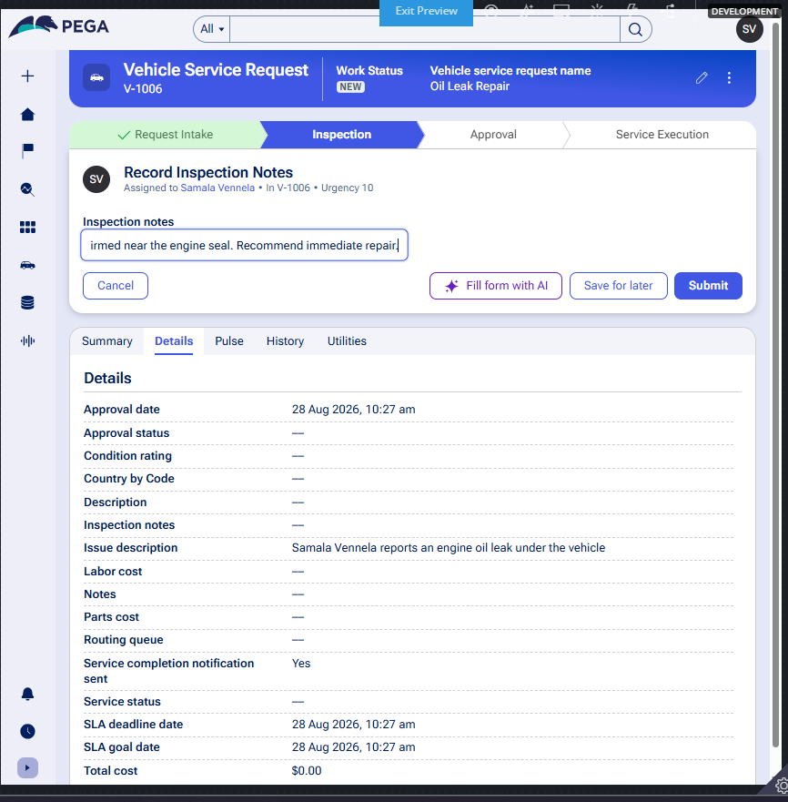
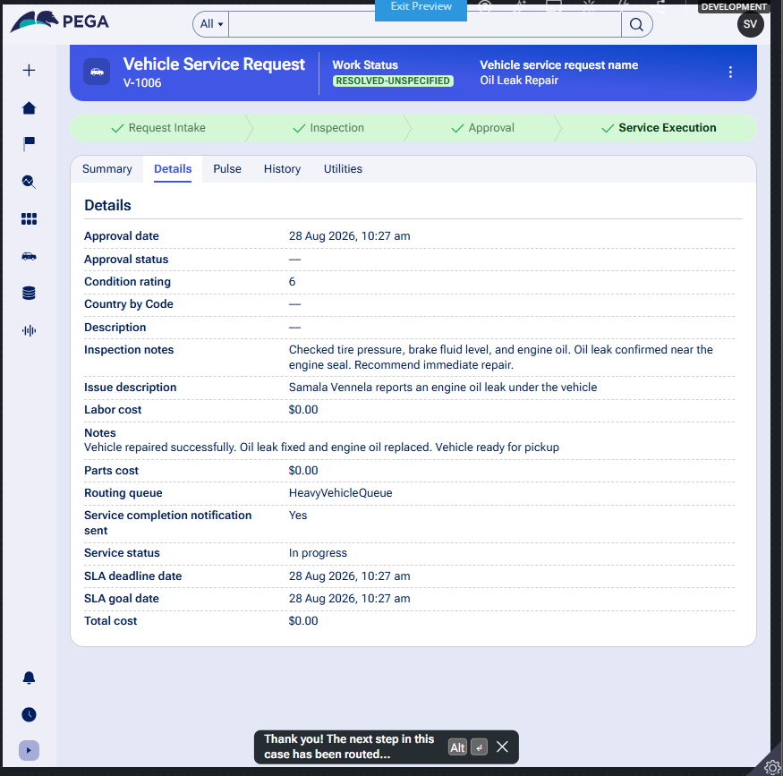
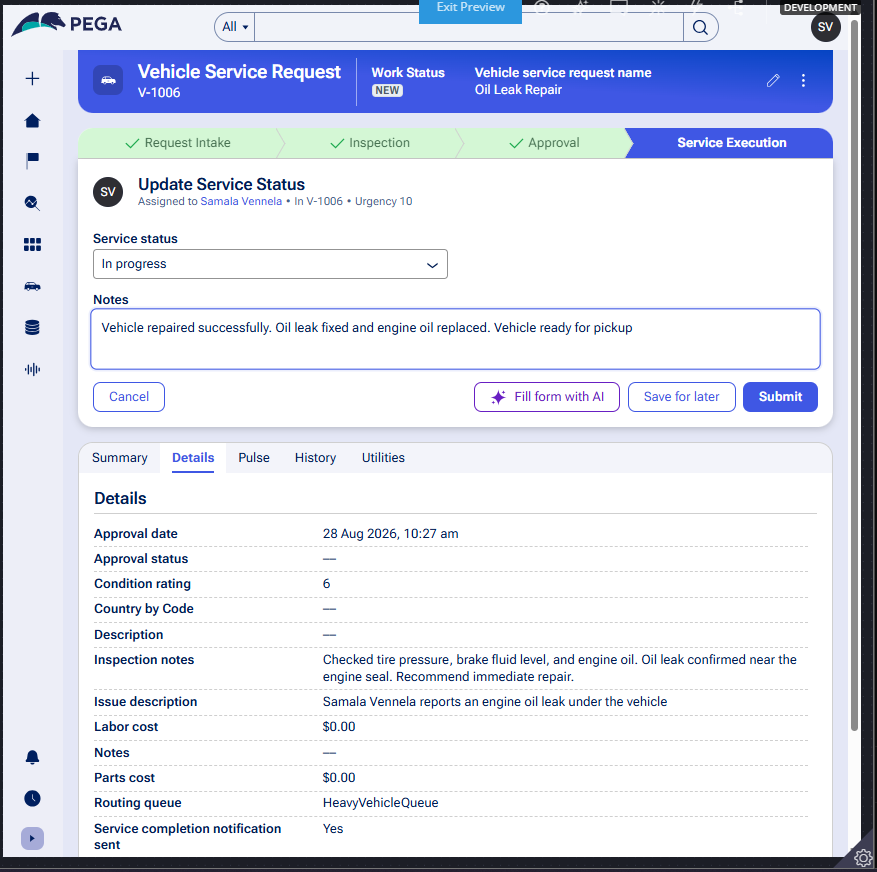

# Vehicle Service Management Application

## Pega National Internship Program

A Pega-based application for managing vehicle service requests from request submission to service completion.

---

## 📌 Project Overview

The Vehicle Service Management Application automates the vehicle service process using Pega Platform.

It allows customers to submit service requests, enables service advisors to inspect vehicles and generate service estimates, provides customer approval, and routes approved requests to the appropriate technician work queue.

---

## 🛠️ Technology

- **Platform:** Pega Platform
- **Application:** NIP-VehicleService-SamalaVennela
- **Case Type:** Vehicle Service Request

---

## 🔄 Application Workflow

**Request Intake**  
↓  
**Inspection**  
↓  
**Service Estimate**  
↓  
**Customer Approval**  
↓  
**Vehicle-Type Routing**  
↓  
**Service Execution**  
↓  
**Service Completion**

---

## ✨ Key Features

- Vehicle Service Request creation
- Vehicle inspection and condition rating
- Service estimate generation
- Automatic service cost calculation
- Customer estimate approval or rejection
- Vehicle data management
- Automatic technician assignment
- Vehicle-type-based routing
- Service completion notification
- Service Level Agreement (SLA) management

---

## ⚙️ Important Rules

| Rule | Type | Purpose |
|---|---|---|
| `CalculateTotalCost` | Data Transform | Calculates total service cost |
| `RouteByVehicleType` | Data Transform | Routes cases based on vehicle type |
| `ServiceCompletionNotification` | Correspondence | Handles service completion notification |

---

## 🚦 Vehicle Routing

Service requests are routed based on vehicle type.

| Vehicle Type | Work Queue |
|---|---|
| Heavy | `HeavyVehicleQueue` |
| Other Types | `LightVehicleQueue` |

---

## ⏱️ SLA

| Configuration | Value |
|---|---|
| Goal | 2 Days |
| Deadline | 3 Days |

---

## 📸 Screenshots

### Vehicle Service Request

### Vehicle Inspection

### Service Estimate

### Service Approval

---

## 📄 Project Documentation

The complete project documentation, including user stories, implementation details, configuration details, screenshots, challenges, and solutions, is available in the [Documentation](Documentation) folder.

---

## 🎥 Demo

A demonstration of the Vehicle Service Management Application is available below.

▶️ **[Watch the Project Demo](https://youtu.be/GV0m7aB-g6w)**

The demo covers:

- Vehicle Service Request
- Vehicle Inspection
- Service Estimate
- Total Cost Calculation
- Customer Approval
- Vehicle-Type Routing
- Service Execution
- Case Details and SLA Information

---

## 👩‍💻 Author

**Samala Vennela**

ACE Engineering College  
CSE

---

## 📌 Project Status

**Completed and submitted as part of the Pega National Internship Program.**
